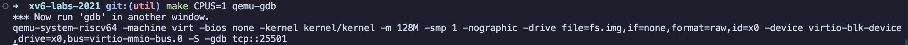
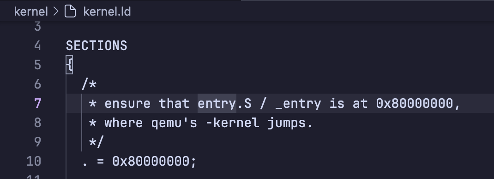
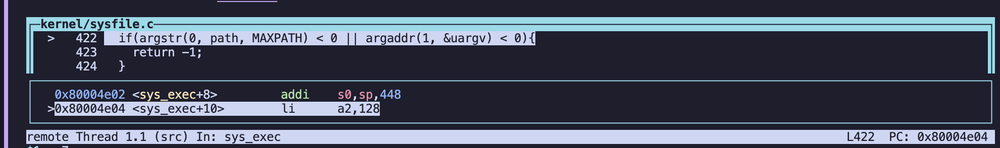

# 使用 gdb debug xv6

1.  `make CPUS=1 qemu-gdb` 启动qemu，打开 gdb-server，可以看到这里server的端口号是`25501`

2. 另起terminal `/opt/homebrew/bin/riscv64-elf-gdb` 打开 gdb-client
3. `target remote 127.0.0.1:25501` 与 server 建立连接
3. `b _entry` 设置入口断点
4. `c` 跳转到入口处，可以发现代码没有停在0x8000000,而是停在0x8000000a，`kernel/kernel.sam`里可以看到
` 8000000a:	f14025f3          	csrr	a1,mhartid` 读取了系统寄存器 `mhartid` 并将结果加载到了 `a1` 寄存器中。`0x8000000`是被qemu认可的地址，使用qemu的时候第一个指令地址必须是这个特定地址。`kernel/kernel.ld`里可以看到是从这个地址开始读

5. `si` 执行下一条指令
6. `b main` 在main.c 打点
7. `layout split` 分割视图

8. `n` next
9. `p` print
10. `s` step into
11. `del 3` 删除断点3

## 参考：
> [https://ftp.gnu.org/old-gnu/Manuals/gdb/html_node/gdb_130.html](https://ftp.gnu.org/old-gnu/Manuals/gdb/html_node/gdb_130.html)

>[layout:https://ftp.gnu.org/old-gnu/Manuals/gdb/html_chapter/gdb_19.html](https://ftp.gnu.org/old-gnu/Manuals/gdb/html_chapter/gdb_19.html)

>[https://www.bilibili.com/video/BV1rS4y1n7y1/?p=2&vd_source=fcca71b554b349a93525c9acd148c2cf](https://www.bilibili.com/video/BV1rS4y1n7y1/?p=2&vd_source=fcca71b554b349a93525c9acd148c2cf)
